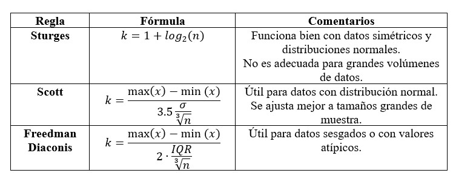

# 1. Objetivo

Construir portafolios de inversión con activos de capital, en donde se analice el principio de diversificación propuesto por H.
Markowitz (1952).

Construir la frontera eficiente para un portafolio de activos financieros; estimar el portafolio de mínima-varianza y medida de desempeño Sharpe-ratio.

Ayudas:
Tidy Portfolio management in R: https://www.tidy-pm.com/
PortfolioAnalytics with RStudio.pdf


Librerías:

```{r,include=FALSE}
library(quantmod) # permite vincular R con portales
library(PortfolioAnalytics)
library(ROI)
library(ROI.plugin.glpk)
library(ROI.plugin.deoptim)
library(ROI.plugin.quadprog)
library(fBasics) # estadísticos
library(psych) # estadísticos
library(readxl) # importar datos de excel
library(writexl) # exportar objetos a excel
library(readr)
library(stats) # estadísticas
library(nortest) # pruebas de Normalidad
library(imputeTS) # permite interpolar datos
library(urca)
library(ggplot2)
library(ggcorrplot)
library(tidyquant)
library(tibble)
library(timetk)
library(plotly)

```


# 2. Import Financial Data

TICKERS:
```{r, Tickers}

# Government_ETFs: GOVT (1-30Y), TLT- (20Y+), IBTA (1-3Y), IEF (7-10Y), IEI (3-7Y), SHY (1-3Y).
#example_class = c("SHEL","CVX","BKR","NKE","SAM","FORD","GOOG","DELL","AMZN","MRVL","GOVT","TLT","IBTA.L","IEF","IEI","SHY")

#Robinhood file: [Ticker , Current QTY]:
ticker_qty <- read_xlsx("Robinhood.xlsx")

tickers = ticker_qty[[1]] # Vector of Tickers for getSymbols function below


```

Get Price Information and AdjPrice dataframe
```{r, Price Information}
# Price information for all Tickers
fecha_inicial = "2021-04-25" # Fecha de inicio con Robinhood
today = Sys.Date()
getSymbols(Symbols= tickers, from=fecha_inicial, to=today, periodicity = "daily", src = "yahoo")


# Get data for a given Ticker in a Matrix: index (date) ,TICKER.Open, TICKER.High, TICKER.Low, TICKER.Close, TICKER.Volume, TICKER.Adjusted
ticker_data <- function(ticker){
  get(tickers[ticker])
}
  
# Dataframe (df) with Adjusted Prices of all tickers.
AP = list()
rawprices = data.frame()
for (i in 1:length(tickers)){
  #ticker_data = (get(tickers[i]))
  AP[[i]] = ticker_data(i)[,6]
}
rawprices = do.call(cbind, AP)
colnames(rawprices)<-c(tickers)
tail(rawprices,5)

```
# 3. EDA (Exploratory Data Analysis)
NAs
```{r, Check for NA}
# Count NA values in each Ticker
colSums(is.na(rawprices))
```
Imputar
```{r, Imputar Valores 'spline'}
# Imputar valores NA usando interpolacion (spline in this case)
prices.in<-na_interpolation(rawprices,option="spline")

# Confirm zero NA
colSums(is.na(prices.in))

# verificamos nuevamente la existencia de espacios en blanco
prices.in[!complete.cases(prices.in),]
```
# 4. Log Returns

Calculates the difference between consecutive values in the log-price series. Since $$ \ln (P_{t})-\ln (P_{t-1})=\ln (P_{t}/P_{t-1}) $$, this gives you the log return.

Converts a time series of prices into a time series of continuously compounded returns, which is a fundamental first step for most quantitative financial analysis. $$\text{Log Return}_{t}=\ln (P_{t})-\ln (P_{t-1})=\ln \left(\frac{P_{t}}{P_{t-1}}\right)$$

Symmetry in gains and losses
Log returns are symmetrical, which provides a more accurate representation of gains and losses. For example:
A stock price dropping from $100 to $50 is a simple return of -50%. It then requires a +100% simple return (back to $100) to recover.The log return for the drop is $$\ln (50/100)\approx -69.3\%$$ The log return for the gain is $$\ln (100/50)\approx +69.3\%$$ Since the log returns are perfectly symmetrical around zero, they provide a clearer picture of the true impact of price movements.

Approximation of normality
Financial models and statistical tests often assume that asset returns are normally distributed. The distribution of log returns is often closer to a normal distribution than that of simple returns. This makes log returns more suitable for models that rely on assumptions of normality, such as those used for risk management and options pricing.

Mathematical convenience
Many financial theories and models, such as the famous Black-Scholes options pricing model, are built on the assumption that log returns (or asset prices) follow a specific process, such as a log-normal random walk. Using log returns keeps the mathematics consistent with these established frameworks.

```{r}
# Construimos un objeto llamado ret.assets (ret: return) en donde almacenamos los cambios porcentuales de los precios utilizando el enfoque log (logaritmo natural) o Logatitmic Return (ln)
# diff, son primeras diferencias: P(1) - P(0)
#calculates the continuously compounded, or logarithmic (ln), returns of an asset and removes any missing values from the result.
 
ret.assets<-na.omit(diff(log(prices.in))) #uses ln
ret.assets
```
## 4.1 Average Daily Assets Returns

```{r}
# Average Daily Return (recordar que son retornos logaritmicos)
assets.mean<-round(colMeans(ret.assets),6)
assets.mean
```
## 4.2 Standard Deviation of Assets Returns

```{r}
assets_std<-round(StdDev(ret.assets),6)
assets_std
```

## 4.3 Plot: Prices and LogReturns

************
FIRST Asset
************

```{r,price and returns FIRST asset in the list}
# Price and Returns of the FIRST asset in the list
plot(prices.in[,1], main=paste("Adj. Prices: ",names(prices.in)[1])) 

lines(ret.assets[,1],type="h",
      on=NA,
      col="blue",
      main=paste("Returns:",names(ret.assets)[1]))
```

## 4.4 Descriptive Statistics (Returns)

```{r}

print(paste("minimo de los retornos:", min(ret.assets)))
print(paste("maximo de los retornos:", max(ret.assets)))
print(paste("promedio de los retornos:", mean(ret.assets)))
print(paste("mediana de los retornos:", median(ret.assets)))

describe(ret.assets)
```

Curtosis: Cuando la curtosis K> 3 entonces decimos la ddp es leptocurtica, K=3 mesocurtica y K<3 platicurtica.
Resumen: la distribución de probabilidad de los cambios porcentuales de los activos financieros, no es una Normal.
Esto es algo normal del mercado, es poco probable (casi cero) de que ocurran eventos extremos.
Sesgo (Skewness), positivo o negativo Negativo: mayormente hemos observado caídas que alzas Positivo: mayormente hemos observado alzas que caidas

## 4.5 Correlation

```{r}
rets.cor<-cor(ret.assets)
rets.cor

ggcorrplot(rets.cor,tl.cex = 7,lab=TRUE,lab_size = 2, title = "Portfolio's assets correlation", hc.order = TRUE)
```

## 4.6 Variance-Covariance Matrix of Portfolio Assets

$$s_{jk}=\frac{1}{n-1}\sum _{i=1}^{n}(x_{ij}-\hat{x}_{j})(x_{ik}-\hat{x}_{k})$$
```{r}
cov.port<-round(cov(ret.assets),6)
cov.port

```

## 4.7 Histogram: Daily Returns

***********
FIRST asset
***********



Regla de los Bins para Histogramas.

Podemos calcular los bins de diferentes formas:

```{r}

# STURGES, SCOTT y FREDMAN DIACOINS

# "nclass" numero de clases (k o bins)

k_sturges <- nclass.Sturges(ret.assets[,1]) # Adecuada para pocos datos, pero no en distribuciones muy asimétricas.
k_scott <- nclass.scott(ret.assets[,1])     # Adecuada para distribuciones normales con datos grandes.
k_freedman <- nclass.FD(ret.assets[,1])     # Adecuada si hay valores atípicos o datos sesgados.
```

```{r}

for (i in 1:ncol(ret.assets)){
  hist_first <- hist(ret.assets[,i], breaks = k_scott, main = paste("Histograma con curva normal:", colnames(ret.assets)[i]),
          cex.main=0.8,cex.axis=0.8,xlab = paste("Returns ", names(ret.assets)[i],"%"),ylab = "Frecuencia",cex.lab=0.8)
  xfit <- seq(min(ret.assets[,i]), max(ret.assets[,i]), length = 100)
  yfit <- dnorm(xfit, mean = mean(ret.assets[,i]), sd = sd(ret.assets[,i]))
  yfit <- yfit * diff(hist_first$mids[1:2]) * length(ret.assets[,i])
  abline(v = mean(ret.assets[,i]), col = "blue", lty = "solid", lwd = 2)      # mean
  abline(v = median(ret.assets[,i]), col = "red", lty = "dashed", lwd = 2)    # median
  lines(xfit, yfit, col = c("black"), lwd = 2)                                # normal distribution
}

```

## 4.8 Análisis de Series de Tiempo

### 4.8.1 Normalidad: Lilliefors (Kolmogorov-Smirnov) [test for normality]

La hipótesis nula (H0):     los rendimientos SI se distribuyen como una Normal.
La hipótesis alterna (H1):  los rendimientos NO se distribuyen como una Normal.

Interpretación: si el p-value es mayor que 0.05 entonces NO se rechaza la H0; si el p-value es menor que 0.05 entonces se rechaza la H0.
Los rendimientos del asset No se distribuyen como una Normal si p=<0.05 y viceversa.

************
FIRST Asset
************

```{r}
norm_test_result = lillie.test(ret.assets[,1])
print(norm_test_result)
if(norm_test_result$p.value > 0.05){
  print(paste("Dado que p-value>0.05, entonces NO se rechaza la hipotesis nula H0, es decir, Los rendimientos de -->",colnames(ret.assets[,1]) ,"<-- SI se distribuyen de forma Normal"))
} else{
  print(paste("Dado que p-value <= 0.05, entonces SI se rechaza la Hipotesis nula H0, los rendimientos de -->",colnames(ret.assets[,1]) ,"<-- NO se distribuyen como una Normal"))
}
  
```

### 4.8.2 Estacionareidad: Augmented-Dickey-Fuller Unit Root Test

Null Hypothesis (H0): The time series has a unit root (it IS NOT stationary).
Alternative Hypothesis (H1): The time series does not have a unit root (it IS stationary).

Decision Rule: You reject the null hypothesis if the absolute value of the test statistic is larger than the absolute value of the critical value, or equivalently, if the test statistic is a more negative number (further to the left on the number line) than the critical value.

Test-statistic.
Critical values
  1% significance level
  5% significance level
  10% significance level


************
FIRST Asset
************


#### 4.8.2.1 Returns are Stationary

Se observara que los Retornos SI son estacionarios pero los Precios NO.

1.  La prueba se realiza sobre los Rendimientos o Retornos logarítmicos: Se observa que los Retornos SI son Estacionarios

```{r}
FIRST_asset_ur<-ur.df(ret.assets[,1],type = "none")
summary(FIRST_asset_ur)
```

Regla de dedo: si el estadístico de prueba en valor absoluto es mayor que los valores críticos en valor absoluto, entonces se dice que la serie de tiempo es ESTACIONARIA.
Entonces decimos que, las variaciones porcentuales (retornos) del activo financiero corresponden a una serie estacionaria.

Una serie estacionaria en estadística es aquella serie temporal cuyas propiedades estadísticas, como la media y la varianza, se mantienen constantes a lo largo del tiempo.
Esto significa que no hay tendencia al alza o a la baja a largo plazo, y la variabilidad de los datos alrededor de la media es también constante.
Una serie estacionaria es más fácil de predecir, ya que sus características no cambian con el tiempo.

Media constante: El valor promedio de la serie no cambia con el tiempo.
Varianza constante (homocedasticidad): La dispersión de los datos con respecto a la media permanece igual a lo largo del tiempo.
Sin tendencia: No hay un patrón de crecimiento o decrecimiento a largo plazo en la serie.
Independencia temporal (para modelos más estrictos): En un sentido más formal, las probabilidades de eventos futuros son independientes del orden en el tiempo.

¿Por qué es importante?
La estacionariedad es fundamental en el análisis de series temporales por varias razones: Facilita la predicción: Si una serie se ha comportado de una manera en el pasado, se puede predecir con mayor probabilidad su comportamiento futuro.
Simplifica el modelado: Los métodos estadísticos y los modelos para series estacionarias son más sencillos de aplicar y proporcionan resultados más fiables.
Validez de los resultados: Muchos procedimientos y pruebas estadísticas requieren que los datos sean estacionarios para ser válidos.

Ejemplo de serie estacionaria: Un proceso de ruido blanco, donde los valores oscilan aleatoriamente alrededor de una media constante con variabilidad constante, es un ejemplo clásico de serie estacionaria.
Ejemplo de serie no estacionaria: Los precios de un activo financiero a menudo muestran tendencias y cambios en su variabilidad, por lo que no suelen ser estacionarios.

Based on the results of the Augmented Dickey-Fuller (ADF) test, the time series you're analyzing does not have a unit root and is stationary.

Understanding the ADF Test The Augmented Dickey-Fuller (ADF) test is a statistical test used to determine if a time series has a unit root, which would indicate that it's non-stationary.

A non-stationary time series has properties like mean, variance, and autocorrelation that change over time.
These series are often unpredictable and can lead to spurious regression results.

A stationary time series has constant statistical properties over time, making it easier to model and forecast.

The ADF test has two competing hypotheses:

Null Hypothesis (H0): The time series has a unit root (it's non-stationary).

Alternative Hypothesis (H1): The time series does not have a unit root (it's stationary).

Interpreting Your Results The core of the interpretation lies in comparing the calculated test statistic to the provided critical values.
The critical values represent the thresholds for rejecting the null hypothesis at different significance levels (1%, 5%, and 10%).

Test-statistic: Your calculated value is -24.5868.
Critical values:
1% significance level: -2.58
5% significance level: -1.95
10% significance level: -1.62

Decision Rule: You reject the null hypothesis if the absolute value of the test statistic is larger than the absolute value of the critical value, or equivalently, if the test statistic is a more negative number (further to the left on the number line) than the critical value.

Your Conclusion:

Since your test statistic of -24.5868 is much more negative than all the critical values, you can reject the null hypothesis at all conventional significance levels (1%, 5%, and 10%).

This means you have very strong evidence to conclude that the time series does not have a unit root and IS stationary.

#### 4.8.2.2 Prices are not Stationary

2.  Se contrasta utilizando los precios. Se observa que los Precios NO son Estacionarios

```{r}
FIRST_asset_price.ur<-ur.df(prices.in[,1],type = "none")
summary(FIRST_asset_price.ur)
```
Conclusion: Los Precios NO son estacionarios, NO se rechaza la hipótesis nula (H0).


# 5. Current Portfolio Robinhood

```{r}
# Positions (qty) of each asset
Robinhood_current_df <- ticker_qty #<- Matrix: [Ticker, QTY]

# From 'prices.in' (prices inputed) get the last date AdjPrice for each Ticker
last_AdjPrice = tail(prices.in, n=1) #tail(df, n=1)
last_AdjPrice = t(last_AdjPrice) #transpose of last Adjusted Prices

#Combine lastAdjPrice and [Tickers, Positions] 
Robinhood_current_df = cbind(Robinhood_current_df, last_AdjPrice)

#Add 'Mkt Value 'column based on Assets possitions and latest AdjPrice, note: could be different than the latest Close Price.
Robinhood_current_df["Current Mkt Value"] = Robinhood_current_df["Current QTY"] * last_AdjPrice

#Calculate the Total amount Invested
total_investment_current = sum(Robinhood_current_df["Current Mkt Value"])
print(paste("Total Invested: $",round(total_investment_current,3)))

Robinhood_current_df["Current Weights"] = Robinhood_current_df["Current Mkt Value"]/total_investment_current

print(paste("Sum of weights:",sum(Robinhood_current_df["Current Weights"])))

#Note: is not an actual Dataframe but a MATRIX
print(Robinhood_current_df)

```

Weights of Current Portfolio
```{r}
for(i in Robinhood_current_df["Ticker"]){
  tickers_ = c(i)
}
for (i in Robinhood_current_df["Current Weights"]){
  weights_ = c(i)
}


# Bar plot with uniform width
ggplot(data = NULL, mapping = aes(tickers_, weights_))+
    geom_col(width = 0.6, fill = "skyblue", color = "blue") +
    theme(axis.text.x = element_text(angle = 90, vjust = 0.5, hjust = 1))+
    labs(title = "Weights of current Portfolio", x = "Tickers", y = "weight")
```

## 5.1 Return, Var, Risk, SR

Combinación Rendimiento y Weights del portafolio aleatorio
Metodo simple: 
Annualized Portfolio Return = [promedio de retornos diarios por Asset] x [weights] x 252

$$\text{Annualized  Portfolio  Returns}=[\text{Daily Avg. Return of each Asset}]\text{x}[Weights]*252$$
Variance-Covariance Matrix of Portfolio Assets

$$s_{jk}=\frac{1}{n-1}\sum _{i=1}^{n}(x_{ij}-\hat{x}_{j})(x_{ik}-\hat{x}_{k})$$
1. Calculate the Covariance Matrix of the Portfolio
2. multiply for weights
3 sqrt of variance to get std dev.

```{r}

#return
current_port_ret<-(as.vector(t(Robinhood_current_df["Current Weights"]))%*%assets.mean)*252

#covariance
cov_current_port<-round(cov(ret.assets),6)
  
#variance
var_current_port = as.vector(t(Robinhood_current_df["Current Weights"]))%*%cov_current_port%*%as.vector(t(Robinhood_current_df["Current Weights"]))

#Std Dev
current_port_sd<-sqrt(var_current_port*252)

#Sharpe Ratio
current_port_sr<-(current_port_ret)/current_port_sd

print("Annual values Current Robinhood Portfolio:")
print(paste("Return current portfolio:",round(current_port_ret,4)))
print(paste("Risk current portfolio:",round(current_port_sd,4)))
print(paste("Sharpe Ratio current portfolio:",round(current_port_sr,4)))
```


# 6. Construcción de "n" Random portafolios

Consideramos los siguientes pasos:

1)  número de simulaciones equivalente al número de portafolios por construir;
2)  el objeto en donde guardaremos las "n" proporciones posibles asignadas a cada activo;
3)  el objeto en donde guardaremos los "n" rendimientos posibles del portafolio;
4)  el objeto con las "n" desviaciones estándar del portafolio;
5)  el objeto con los "n" Sharpe Ratios;
6)  finalmente, la simulación.


Definir vectores y matrices
```{r}
simul<-10000
sim.wgts<-matrix(nrow = simul,ncol=length(tickers))
sim.rets<-as.numeric(vector(length = simul))
sim.risk<-as.numeric(vector(length = simul))
sim.sharpe<-as.numeric(vector(length=simul))
```

Creamos la simulación a través de un ciclo FOR.

Simulated Weights, Portfolio Returns, Portfolio StdDev, Portfolio Sharp Ratio; for each simulation (Anualizados):

To create different portfolios with the same Assets but different weights,
this leads to different returns and stdDev for each portfolio.
```{r}
set.seed(42)
for (portfolio_number in seq_along(sim.rets)) { 
  wgts<-runif(length(tickers))
  wgts<-wgts/sum(wgts) #random weights for each portfolio
  sim.wgts[portfolio_number,]<-wgts
  
  port.ret<-(wgts%*%assets.mean)*252
  sim.rets[portfolio_number]<-port.ret
  
  port.sd<-sqrt((wgts%*%cov.port%*%wgts)*252)
  sim.risk[portfolio_number]<-port.sd
  
  sr<-(port.ret)/port.sd
  sim.sharpe[portfolio_number]<-sr
}
```


DataFrame con Risk and Return de todas las simulaciones:
```{r}
portafolios<-data.frame(sim.risk,sim.rets)
```

Plot de Riesgo vs Returns de las simulaciones:
```{r}
ggplot(portafolios,aes(x=sim.risk, y=sim.rets)) + 
        geom_point(alpha=0.2) + 
        theme_minimal() +
        labs(title='Frontera Eficiente', x= 'Riesgo', y='Rendimiento')

```

Guardamos los valores en una tabla tipo TIBBLE

```{r}
 #tibble() constructs a data frame
valores.portafolio<-tibble(Rendimiento=sim.rets,  
                           Riesgo=sim.risk,
                           Sharpe=sim.sharpe)
```

El objeto de las proporciones dentro del LOOP es tipo "matriz" la cual se 
convierte a tipo "tabla" para combinar con el objeto "valores.portafolio".
```{r}
sim.wgts1<-tk_tbl(sim.wgts, preserve_index = FALSE) 

# tk_tbl() "forzar" is designed to coerce time series objects (e.g. xts, zoo, ts, timeSeries, etc) to tibble objects (like data.frame).
                            
# To coerce means to force an object of one class into an object of another class. It's an explicit conversion. When you coerce a time-series object to a tibble, you are essentially restructuring the data from its specialized time-series format into a standard, tidy table format. This conversion typically involves:

#Creating a column for the time or date index.
#Creating one or more columns for the data values.

#For example, a time-series object might be a vector with a hidden time attribute. Coercing it to a tibble would create a two-column tibble: one column for the date/time and another for the data values. This makes it much more straightforward to perform operations like filtering by date, summarizing data, or creating visualizations using ggplot2.
```

Cambiamos de nombre a las columnas del objeto "sim.wgts1"
```{r}
colnames(sim.wgts1)<-colnames(ret.assets)
sim.wgts1 #<- weights of each random portfolio
```

Combinamos el objeto de "sim.wgts1" con "valores.portafolio" (juntar ambos data sets)

```{r}
all.portfolios<-tk_tbl(cbind(sim.wgts1,valores.portafolio), preserve_index = FALSE) 
# Take a sequence of vector, matrix or data-frame arguments and combine by columns or rows, respectively
```

```{r}
head(all.portfolios)
```

## 6.1 Mínima Varianza y Máximo Sharpe of RANDOMLY weighted Portfolios.

El portafolio de mínima varianza es aquel con el menor valor de la desviación estándar (riesgo).
```{r}
# Portafolio de minima Varianza
minvar_port_row_num = which.min(valores.portafolio$Riesgo)
minvar_port_row_num
minvar.port<-valores.portafolio[minvar_port_row_num,]
minvar.port
print(sim.wgts1[minvar_port_row_num,])


```

Portafolio con Maximo Sharpe Ratio (Return/Risk)
```{r}

# Portafolio de maximo Sharpe Ratio
maxsr_port_row_num = which.max(valores.portafolio$Sharpe)
maxsr_port_row_num
maxsr.port<-valores.portafolio[maxsr_port_row_num,]
maxsr.port
print(sim.wgts1[maxsr_port_row_num,])

```

## 6.2 Plot: Portafolios

```{r,frontier}

# Reminder, valores.portafolio es un tibble con [Rendimiento - Riesgo - Sharpe]

p <- valores.portafolio %>% #The %>% symbol in R Studio is the "PIPE" operator. 
                            #It's used to chain together multiple operations, sending the result of one function as the first argument of the next function.
  ggplot(aes(x = Riesgo, y = Rendimiento, color = Sharpe)) +
  geom_point() +
  theme_classic() +
  scale_y_continuous(labels = scales::percent) +
  scale_x_continuous(labels = scales::percent) +
  labs(x = 'Riesgo Anualizado',
       y = 'Rendimiento Anualizado',
       title = "Risk vs Return of 'n' Randomly weighted Portfolios | Sharpe Ratio") +
  geom_point(aes(x = Riesgo,
                 y = Rendimiento), data = minvar.port, size = 4) + # min Variance portfolio
  geom_point(aes(x = Riesgo,
                 y = Rendimiento), data = maxsr.port, size = 4) # max SR portfolio
ggplotly(p)
```

# 7. Portafolios con "PortfolioAnalytics"

Con la siguiente instrucción guardamos en un objeto el número de columnas del objeto "subassets" ya que usaremos dicho dato en la simulación para conformar "n" portafolios.

```{r}
#num_assets<-ncol(tickers)
#num_assets
```

Creamos los subgrupos de activos según clasificados por renta variable y renta fija

```{r}
variable.select<-tickers #c("SHELL","NIKE","FORD","SAM","DELL","AMAZON","MARVEL")
variable.subassets<-ret.assets[,variable.select]
```

```{r}
# Assets de Renta Fija
#fija.select<-c("GOVT","TLT")
#fija.subassets<-ret.assets[,fija.select]
```


## 7.1 Portafolio de Mínima Varianza

Creacion del portafolio y agregar Restricciones del portafolio (minimize risk)

```{r}

port_min_var<-PortfolioAnalytics::portfolio.spec(assets=tickers)

# full_investment: Special case to set min_sum=1 and max_sum=1 of weight sum constraints
port_min_var<-PortfolioAnalytics::add.constraint(portfolio = port_min_var,
                                      type = "full_investment") 

# box: box constraints for the individual asset weights, see box_constraint
port_min_var<-PortfolioAnalytics::add.constraint(portfolio = port_min_var,
                                      type = "box", 
                                      min=0.00, max=0.99)

###########################################################################
# Esta seccion es por si agrego un bloque de assets de Renta Fija (arriba) 
###########################################################################
# port_min_var<- PortfolioAnalytics::add.constraint(portfolio = port_min_var, 
#                                       type="group", # group: specify the sum of weights within groups and the number of assets with non-zero weights in groups
#                                       groups= list(c(variable.subassets),c(fija.subassets)),
#                                       group_min=c(0.00,0.00),
#                                       group_max=c(0.9,0.1)
#                                       )
###########################################################################


port_min_var<-PortfolioAnalytics::add.objective(portfolio = port_min_var,
                                                type = "risk",
                                                name = "StdDev")

```

Optimización del Portafolio de Minima Varianza

```{r}
port_min_global<-PortfolioAnalytics::optimize.portfolio(ret.assets,
                                                        portfolio = port_min_var,
                                                        optimize_method = "ROI", 
                                                        # ROI: R Optimization Infrastructure, 
                                                        # se refiere al conjunto de métodos matemáticos 
                                                        # que optimizan la solución de un problema
                                                        trace = TRUE) 
                                                        # if TRUE will attempt to return additional 
                                                        # information on the path or portfolios searched
port_min_global
```

Validación de las proporciones (weights)

Visualizamos las proporciones (weights) minimo y maximo weights fueron establecidos arriba

```{r}
#chart.Weights(port_min_global)

chart.Weights(
  port_min_global,
  neighbors = NULL,
  main = "Weights",
  las = 3,
  xlab = NULL,
  cex.lab = 0.8,
  element.color = "darkgray",
  cex.axis = 0.8,
  colorset = NULL,
  legend.loc = "topright",
  cex.legend = 0.8,
  plot.type = "barplot" # can be "line"
)
```

Extraemos la desviación estándar y Anualizamos

```{r}
risk_minVar<-port_min_global[["objective_measures"]][["StdDev"]]
print("StdDev del Portafolio:")
risk_minVar

risk_minVar_annual<-risk_minVar*sqrt((252))
print("Anualizada:")
risk_minVar_annual
```

Confirmar que proporciones sumen 1

Guardamos en un objeto las proporciones

```{r}
opt.wghts<-matrix(extractWeights(port_min_global))

print(paste("Suma de los weights:", sum(opt.wghts)))
```

### 7.1.1 Return

Multiplicamos las proporciones óptimas por el rendimiento promedio de cada activo que conforma el portafolio óptimo y Anualizamos el rendimiento diario:

```{r}
expected.mean<-(colMeans(ret.assets)%*%opt.wghts)*252
expected.mean
```


## 7.2 Portafolio de Minima Varianza y Maximo Rendimiento (maxSR) Long-only

```{r}
port_mean<-PortfolioAnalytics::portfolio.spec(assets=tickers)

port_mean<-PortfolioAnalytics::add.constraint(portfolio = port_mean,
                                      type = "full_investment")

# Nota: Si se oculta esta restriccion obtenemos posiciones en Short en los resultados finales.
port_mean<-PortfolioAnalytics::add.constraint(portfolio = port_mean,
                                      type = "box",
                                      min=0.0,max=1.0)

###########################################################################
# Esta seccion es por si agrego un bloque de assets de Renta Fija (arriba) 
###########################################################################
# port_mean<- PortfolioAnalytics::add.constraint(portfolio = port_mean, 
#                                       type="group",
#                                       groups= list(c(variable.subassets),c(fija.subassets)),
#                                       group_min=c(0.00,0.00),
#                                       group_max=c(0.90,0.10)
#                                       )
###########################################################################

port_mean<-PortfolioAnalytics::add.objective(portfolio = port_mean,
                                                type = "return",
                                                name = "mean")

port_mean<-PortfolioAnalytics::add.objective(portfolio = port_mean,
                                                type = "risk",
                                                name = "StdDev")

```


Optimizacion del Portafolio para Maximo Sharpe Ratio

```{r}
port_maxSR <- PortfolioAnalytics::optimize.portfolio(ret.assets, 
                                                     portfolio=port_mean,
                                                     optimize_method="ROI",
                                                     maxSR=TRUE, # Maximizar el SR
                                                     trace=TRUE)
port_maxSR
```

Confirm the sum of Weights of maxSR portfolio is = 1

```{r}
weights_df = data.frame(port_maxSR[1])
print(sum(weights_df))
```

Visualizamos las proporciones

```{r}
chart.Weights(
  port_maxSR,
  neighbors = NULL,
  main = "Weights",
  las = 3,
  xlab = "Tickers",
  cex.lab = 0.8,
  element.color = "darkgray",
  cex.axis = 0.8,
  colorset = NULL,
  legend.loc = "topright",
  cex.legend = 0.8,
  plot.type = "barplot" # can be "line",
)
```

```{r}
chart.EfficientFrontier(
  port_maxSR,
  optimize_method = "ROI",
  match.col = "StdDev",
  n.portfolios = 1000,
  xlim = NULL,
  ylim = NULL,
  cex.axis = 0.8,
  element.color = "darkgray",
  main = "Efficient Frontier",
  RAR.text = "SR",
  rf = 0.00034,
  tangent.line = TRUE,
  cex.legend = 0.8,
  chart.assets = TRUE,
  labels.assets = TRUE,
  pch.assets = 21,
  cex.assets = 0.8
)
```
Weights along the efficient frontier
```{r}
# Generate plot of weights along the efficient frontier
chart.EF.Weights(port_maxSR, 
                 n.portfolios = ncol(ret.assets), #number of portfolios (all)
                 match.col = "StdDev")

#FIGURE: Weights plotted along the efficient frontier for the standard Markwoitz (1952) portfolio.
```

### 7.2.1 Return, Risk, SR


```{r}
risk_maxSR<-port_maxSR[["objective_measures"]][["StdDev"]]
mean_maxSR<-port_maxSR[["objective_measures"]][["mean"]]
maxSR = mean_maxSR / risk_maxSR

# Anualizados
risk_maxSR_annual<-risk_maxSR*sqrt((252))
mean_maxSR_annual<-mean_maxSR*252
maxSR_annual<-mean_maxSR_annual / risk_maxSR_annual
print("Annualized values:")
print(paste("Risk (StdDev):", round(risk_maxSR_annual,3)))
print(paste("Return:", round(mean_maxSR_annual,3)))
print(paste("Sharpe Ratio:", round(maxSR_annual,3)))
```

### 7.2.2 Summary y Posiciones

Calcular las Posiciones para el portafolio de maxSR con base en el current portfolio's total invested in Robinhood

```{r}
# Con base en los weights obtenidos para el maxSR portfolio calcular el Mkt Value
Mkt_value_maxSR = round(weights_df * total_investment_current, 3)
colnames(Mkt_value_maxSR) = "maxSR Mkt Value"

# Calcular la cantidad de stocks o Posiciones para cada Asset 
# con base en su Makt Value y el last AdjPrice (note: different than 'Close' Price)
maxSR_QTY = round(Mkt_value_maxSR / last_AdjPrice , 3)
colnames(maxSR_QTY) = "maxSR QTY"

# Combinar en un dataframe
posiciones_maxSR_df = cbind.data.frame(last_AdjPrice, maxSR_QTY, Mkt_value_maxSR)

# Summary of maxSR
print("---------------------------------------------------")
print("Summary of PortfolioAnalitics (Max Sharp Ratio and Min Var)")
print("---------------------------------------------------")
print(paste("Total del Portafolio: $", sum(Mkt_value_maxSR)))
print(paste("StdDev (risk):", round(100*risk_maxSR_annual, 3), "%"))
print(paste("Return:", round(100*mean_maxSR_annual, 3), "%"))
print(paste("Sharp Ratio:", round(maxSR_annual, 3)))
print("Posiciones:")
posiciones_maxSR_df
```


# 8. Plot: All Portfolios

Pero ahora con Portafolios de Minima Varianza y Maximo SR y Current Portfolio

```{r}
p <- valores.portafolio %>%
  ggplot(aes(x = Riesgo, y = Rendimiento, color = Sharpe)) +
  geom_point() +
  theme_classic() +
  scale_y_continuous(labels = scales::percent) +
  scale_x_continuous(labels = scales::percent) +
  labs(x = 'Riesgo Anualizado',
       y = 'Rendimiento Anualizado',
       title = "Portafolio de Minima Varianza, Maximo Sharpe Ratio, Current, Simulados minVar y MaxRet") +
  geom_point(aes(x = Riesgo,
                 y = Rendimiento), data = minvar.port, color = 'red') + #minVar (from "n" random portfolios)
  geom_point(aes(x = Riesgo,
                 y = Rendimiento), data = maxsr.port, color = 'red') + #maxsr (from "n" random portfolios)
  geom_point(aes(x = risk_minVar_annual,
                 y = expected.mean), color = 'green') +   # minVar (from 'PortfolioAnalitics')
  geom_point(aes(x = risk_maxSR_annual,
                 y = mean_maxSR_annual), color = 'blue')+ # MaxSR (from "PortfolioAnalitics")
  geom_point(aes(x = current_port_sd,
                 y = current_port_ret), color = 'orange', size = 4) # Current Robinhood Portfolio
ggplotly(p)
```


# 9. Long/Short of Current portfolio to be maxSR

```{r}
df_final = data.frame()
df_final = cbind(Robinhood_current_df, posiciones_maxSR_df)
df_final <- df_final[, !duplicated(names(df_final))] #remove duplicated last AdjPrice column
df_final["Long/Short"] = df_final["maxSR QTY"] - df_final["Current QTY"]
df_final

#Long/Short" is the position needed to the current portfolio to make it equal to maxSR portfolio.
```

